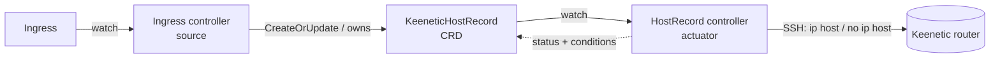

# keenetic-operator

A Kubernetes operator that keeps DNS host records on a **Keenetic router** in sync
with your cluster's Ingresses — GitOps-native, level-triggered, self-healing.


[](https://github.com/Arbuzov/keenetic-operator/actions/workflows/ci.yml)

`external-dns` automates DNS for cloud providers (Route 53, Cloud DNS, Cloudflare…).
Home-lab and edge setups that terminate traffic on a consumer router have no such
automation: every new Ingress means SSHing into the router to add an `ip host` entry
by hand. **keenetic-operator closes that gap.** Declare an Ingress and the matching
`hostname → ingress-IP` record appears on the router; delete it and the record is
cleaned up.

## Architecture

Two controllers in a single manager, mirroring the external-dns *source → actuator* split:



- **Ingress controller (source)** watches `Ingress` and, for each `spec.rules[].host`,
  creates an owned `KeeneticHostRecord`. Deleting the Ingress garbage-collects its
  records through owner references.
- **KeeneticHostRecord controller (actuator)** reconciles each record onto the router
  over SSH, with a finalizer for cleanup, status conditions, and periodic re-assertion
  so manual drift on the router self-heals.

The `KeeneticHostRecord` CRD is useful on its own — declare records for hosts that
don't originate from an Ingress (a NAS, a printer) and they are managed the same way.

## Features

- **GitOps-native** — records are derived from cluster state; commit an Ingress, get a record.
- **Level-triggered & self-healing** — continuous reconcile converges to the desired state; drift is repaired.
- **Finalizer-based cleanup** — records are removed from the router before the object disappears.
- **Idempotent & safe** — reads the router's running-config before writing; guards the 64-entry `ip host` limit and surfaces it as a status condition.
- **Single binary, leader-elected** — one active replica owns router state.

## Quick start

Prerequisites: a cluster, `kubectl`, and SSH access to the router.

```bash
# 1. Install the CRD
make install

# 2. Provide router credentials (edit the values first)
kubectl apply -f config/samples/keenetic_creds_and_sample.yaml

# 3a. Run the controller locally against your kubeconfig
make run
# 3b. …or deploy it into the cluster
make deploy IMG=ghcr.io/Arbuzov/keenetic-operator:latest
```

Any Ingress host then becomes a router record:

```console
$ kubectl get keenetichostrecord
NAME                               HOSTNAME                           ADDRESS         APPLIED
grafana.whitediver.keenetic.link   grafana.whitediver.keenetic.link   192.168.99.50   true
```

## Configuration

The manager reads credentials from the environment (wire them from a Secret via `envFrom`):

| Variable | Default | Purpose |
| --- | --- | --- |
| `KEENETIC_HOST` | `192.168.99.1:22` | Router SSH endpoint |
| `KEENETIC_USER` | — | SSH user |
| `KEENETIC_PASSWORD` | — | SSH password |
| `KEENETIC_MAX_HOSTS` | `64` | `ip host` entry cap (guard) |
| `DEFAULT_INGRESS_IP` | — | Fallback address when an Ingress has no LB IP in `status` |

`KeeneticHostRecord` spec:

| Field | Type | Notes |
| --- | --- | --- |
| `spec.hostname` | string | FQDN to register (required) |
| `spec.address` | string | IPv4 to resolve to (required) |

## How it works

On each reconcile the actuator ensures its finalizer is present, reads the router's
`ip host` table, and adds the entry if missing (persisting with `system configuration
save`). It re-queues every few minutes, so entries deleted by hand on the router are
restored. On deletion the finalizer runs `no ip host` before the object is removed.

## Development

Verified against **Go 1.26**, **Kubebuilder v4.15**, **golangci-lint v2.12**.

```bash
make test           # unit + envtest
golangci-lint run   # lint (config in .golangci.yml)
make build          # build the manager binary
```

CI ([`.github/workflows/ci.yml`](.github/workflows/ci.yml)) runs **lint → test → build → image (→ GHCR)** on every push.

## Roadmap

- **Validating webhook** — reject duplicate hostnames cluster-wide and hosts outside an allowed domain.
- **external-dns webhook provider** — ship Keenetic as a provider so it slots in alongside the built-ins.
- **More CRDs** (routes, interfaces) — grow into a general Keenetic operator.

## License

Apache-2.0. See [LICENSE](LICENSE).
