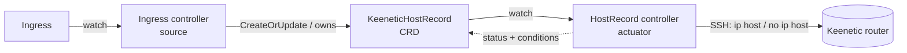

# keenetic-operator

A Kubernetes operator that keeps DNS host records on a **Keenetic router** in sync
with your cluster's Ingresses — GitOps-native, level-triggered, self-healing.


[](https://github.com/Arbuzov/keenetic-operator/actions/workflows/ci.yml)

`external-dns` automates DNS for cloud providers (Route 53, Cloud DNS, Cloudflare…).
Home-lab and edge setups that terminate traffic on a consumer router have no such
automation: every new Ingress means SSHing into the router to add an `ip host` entry
by hand. **keenetic-operator closes that gap.** Declare an Ingress and the matching
`hostname → ingress-IP` record appears on the router; delete it and the record is
cleaned up.

## Architecture

Two controllers in a single manager, mirroring the external-dns *source → actuator* split:


```mermaid
flowchart LR
  ING[Ingress] -->|watch| SRC[Ingress controller<br/>source]
  SRC -->|CreateOrUpdate / owns| CR[KeeneticHostRecord<br/>CRD]
  CR -->|watch| ACT[HostRecord controller<br/>actuator]
  ACT -->|SSH: ip host / no ip host| RT[(Keenetic router)]
  ACT -.->|status + conditions| CR
```

- **Ingress controller (source)** watches `Ingress` and, for each `spec.rules[].host`,
  creates an owned `KeeneticHostRecord`. Deleting the Ingress garbage-collects its
  records through owner references.
- **KeeneticHostRecord controller (actuator)** reconciles each record onto the router
  over SSH, with a finalizer for cleanup, status conditions, and periodic re-assertion
  so manual drift on the router self-heals.

The `KeeneticHostRecord` CRD is useful on its own — declare records for hosts that
don't originate from an Ingress (a NAS, a printer) and they are managed the same way.

## Features

- **GitOps-native** — records are derived from cluster state; commit an Ingress, get a record.
- **Level-triggered & self-healing** — continuous reconcile converges to the desired state; drift is repaired.
- **Finalizer-based cleanup** — records are removed from the router before the object disappears.
- **Idempotent & safe** — reads the router's running-config before writing; guards the 64-entry `ip host` limit and surfaces it as a status condition.
- **Single binary, leader-elected** — one active replica owns router state.

## Quick start

Prerequisites: a cluster, `kubectl`, and SSH access to the router.

```bash
# 1. Install the CRD
make install

# 2a. Run locally against your kubeconfig — credentials come from your shell env
export KEENETIC_HOST=192.168.99.1:22 KEENETIC_USER=... KEENETIC_PASSWORD=...
make run

# 2b. …or deploy into the cluster: this creates the keenetic-operator-system
#     namespace, so the credentials Secret must be applied after (or it has
#     nothing to land in)
make deploy IMG=ghcr.io/Arbuzov/keenetic-operator:latest
kubectl apply -f config/samples/keenetic_creds_and_sample.yaml
```

Any Ingress host then becomes a router record:

```console
$ kubectl get keenetichostrecord
NAME                               HOSTNAME                           ADDRESS         APPLIED
grafana.whitediver.keenetic.link   grafana.whitediver.keenetic.link   192.168.99.50   true
```

## Configuration

The manager reads credentials from the environment (wire them from a Secret via `envFrom`):

| Variable | Default | Purpose |
| --- | --- | --- |
| `KEENETIC_HOST` | `192.168.99.1:22` | Router SSH endpoint |
| `KEENETIC_USER` | — | SSH user |
| `KEENETIC_PASSWORD` | — | SSH password |
| `KEENETIC_HOST_KEY` | — | Router SSH host key, as a `ssh.FingerprintSHA256` string. Unset disables host-key verification (fine for LAN, pin it for anything else) |
| `KEENETIC_MAX_HOSTS` | `64` | `ip host` entry cap (guard) |
| `DEFAULT_INGRESS_IP` | — | Fallback address when an Ingress has no LB IP in `status` |

`KeeneticHostRecord` spec:

| Field | Type | Notes |
| --- | --- | --- |
| `spec.hostname` | string | FQDN to register (required) |
| `spec.address` | string | IPv4 to resolve to (required) |

## How it works

On each reconcile the actuator ensures its finalizer is present, reads the router's
`ip host` table, and adds the entry if missing (persisting with `system configuration
save`). It re-queues every few minutes, so entries deleted by hand on the router are
restored. On deletion the finalizer runs `no ip host` before the object is removed.

## Metrics

The manager serves Prometheus metrics on `--metrics-bind-address` (`:8080` by default),
plain HTTP with no authn/authz filter — fine on a trusted LAN, put it behind something
else if that is not your situation. There is no Service in the manifests: an
annotation-driven scrape (`prometheus.io/scrape: "true"`, `prometheus.io/port: "8080"`)
reaches the pod directly, and no Prometheus Operator is required.

Alongside the usual `controller_runtime_*`, `workqueue_*` and `rest_client_*` families,
the operator exports what only it can see — the state of the router:

| Metric | Type | Labels | Meaning |
| --- | --- | --- | --- |
| `keenetic_router_hosts` | gauge | — | `ip host` entries on the router right now |
| `keenetic_router_hosts_limit` | gauge | — | the configured cap (`KEENETIC_MAX_HOSTS`) |
| `keenetic_router_operations_total` | counter | `operation`, `result` | router SSH operations; `operation` is `ensure`/`delete`/`has`/`count`, `result` is `success`/`error`. Counts only attempts that reach the router — a spec rejected by validation never dials, so it stays out of `result="error"` and out of any alert on router reachability |
| `keenetic_router_operation_duration_seconds` | histogram | `operation` | latency of one logical operation, bucketed 0.1s–12.8s. Not per SSH session: `ensure` covers the read and, when the entry is missing, the write that follows |
| `keenetic_host_records_limit_rejected_total` | counter | — | reconciles that could not apply a record because the router is full |
| `keenetic_host_records_address_conflict_total` | counter | — | hosts the operator stopped maintaining because the Ingresses sharing them report different addresses. An existing record keeps its pre-conflict address on the router; one that did not exist yet is never created |

Deliberately *not* exported: per-record `applied`/`Ready` state. That already lives in each
`KeeneticHostRecord`'s `.status`, and kube-state-metrics'
`--custom-resource-state-config` turns it into metrics without this operator growing a
label per object.

Worth alerting on:

```promql
# The router is full — new Ingress hosts are being dropped silently. This path
# returns no error and requeues, so it is invisible in reconcile_errors_total.
increase(keenetic_host_records_limit_rejected_total[15m]) > 0

# Running out of room before it becomes an outage.
keenetic_router_hosts / keenetic_router_hosts_limit > 0.9

# The router stopped answering. Distinguishes an unreachable router from a
# conflict against the API server, which reconcile_errors_total cannot.
rate(keenetic_router_operations_total{result="error"}[10m]) > 0

# Ingresses sharing a host disagree on its address, so the operator stopped
# maintaining it. Do not read this as "the host is unreachable": if a record
# already existed, the router keeps resolving it to whatever address was stored
# before the conflict, which is the more dangerous case — routing looks healthy
# while it silently goes stale. Only a host that had no record yet is
# unregistered. Either way it is a nil-error path, invisible in
# reconcile_errors_total, and it needs a human to reconcile the Ingresses; the
# operator will not pick a winner.
rate(keenetic_host_records_address_conflict_total[15m]) > 0
```

`keenetic_router_hosts` publishes what the reconcile read from the router, with no
arithmetic on top: nothing accumulates, so the value is always something the router
actually reported. (Raise `MaxConcurrentReconciles` above its default of 1 and two passes
can publish out of order — the value goes stale, never wrong, and the next pass corrects
it.)
The trade is that a record applied by the current pass shows up on the next one, so the
gauge can lag by one entry for up to the 5-minute re-assert interval; use
`keenetic_host_records_limit_rejected_total` when you need the exact moment the cap bites.
It also freezes at its last value if reconciles stop altogether — pair any alert on it
with `up` and `controller_runtime_reconcile_errors_total`.

## Development

Verified against **Go 1.26**, **Kubebuilder v4.15**, **golangci-lint v2.12**.

```bash
make test           # unit + envtest
golangci-lint run   # lint (config in .golangci.yml)
make build          # build the manager binary
```

CI ([`.github/workflows/ci.yml`](.github/workflows/ci.yml)) runs **lint → test → build → image (→ GHCR)** on every push.

Note: envtest doesn't run Kubernetes' garbage collector, so the test suite covers the
explicit "host removed from an Ingress's rules" cleanup path but not the
OwnerReference cascade-delete-on-Ingress-deletion path described above — that one
only gets exercised against a real cluster. The same gap applies to the multi-owner
case: that a shared record survives until the *last* owning Ingress is deleted is
Kubernetes' own GC semantics (dependents go when every owner is gone, controller flag
or not), and nothing here proves it. What the tests do cover is the reconciler's own
bookkeeping — adding an owner, releasing one, and deleting the record when the last
claim is released.

## Roadmap

- **Validating webhook** — reject duplicate hostnames cluster-wide and hosts outside an allowed domain.
- **external-dns webhook provider** — ship Keenetic as a provider so it slots in alongside the built-ins.
- **More CRDs** (routes, interfaces) — grow into a general Keenetic operator.

## License

Apache-2.0. See [LICENSE](LICENSE).
