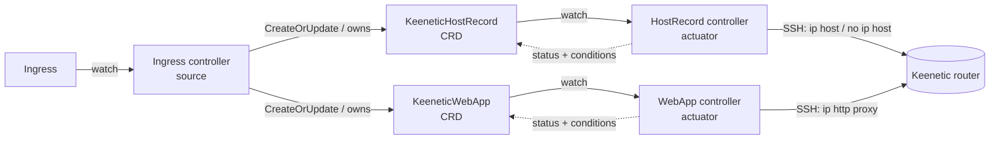

# keenetic-operator

A Kubernetes operator that keeps DNS host records and KeenDNS web-app publications
on a **Keenetic router** in sync with your cluster's Ingresses — GitOps-native,
level-triggered, self-healing.


[](https://github.com/Arbuzov/keenetic-operator/actions/workflows/ci.yml)

`external-dns` automates DNS for cloud providers (Route 53, Cloud DNS, Cloudflare…).
Home-lab and edge setups that terminate traffic on a consumer router have no such
automation: every new Ingress means SSHing into the router to add an `ip host` entry
by hand. **keenetic-operator closes that gap.** Declare an Ingress and the matching
`hostname → ingress-IP` record appears on the router; delete it and the record is
cleaned up.

Reaching the service *from the internet* takes a second, independent entry on the
router, and it is the half that is easy to miss: KeenDNS resolves every subdomain of
your zone to the router, but the router only proxies the names listed under **Domain
name → Access to web applications** (`ip http proxy` in the CLI). A host with a DNS
record and no publication does not fail loudly — the router answers on that name with
its *own* web interface. The operator maintains both entries.

## Architecture

Three controllers in a single manager, mirroring the external-dns *source → actuator* split:


```mermaid
flowchart LR
  ING[Ingress] -->|watch| SRC[Ingress controller<br/>source]
  SRC -->|CreateOrUpdate / owns| CR[KeeneticHostRecord<br/>CRD]
  SRC -->|CreateOrUpdate / owns| WA[KeeneticWebApp<br/>CRD]
  CR -->|watch| ACT[HostRecord controller<br/>actuator]
  WA -->|watch| WAC[WebApp controller<br/>actuator]
  ACT -->|SSH: ip host / no ip host| RT[(Keenetic router)]
  WAC -->|SSH: ip http proxy| RT
  ACT -.->|status + conditions| CR
  WAC -.->|status + conditions| WA
```

- **Ingress controller (source)** watches `Ingress` and, for each `spec.rules[].host`,
  creates an owned `KeeneticHostRecord` and — unless publishing is turned off — an owned
  `KeeneticWebApp`. Deleting the Ingress garbage-collects both through owner references.
- **KeeneticHostRecord controller (actuator)** reconciles each record onto the router
  over SSH, with a finalizer for cleanup, status conditions, and periodic re-assertion
  so manual drift on the router self-heals.
- **KeeneticWebApp controller (actuator)** does the same for `ip http proxy` entries:
  the reverse proxy that makes a name reachable from outside, terminating TLS with the
  router's KeenDNS certificate.

Both CRDs are useful on their own — declare records or publications for hosts that
don't originate from an Ingress (a NAS, a printer) and they are managed the same way.

The two objects deliberately carry **different addresses**. `KeeneticHostRecord.spec.address`
is what the name resolves to, and it has to be the router: resolve it straight to the
ingress controller and traffic bypasses the proxy, so KeenDNS never terminates TLS for it.
`KeeneticWebApp.spec.upstreamAddress` is where the router forwards, i.e. the ingress
controller itself. Collapsing them into one field would break one of the two paths.

## Features

- **GitOps-native** — records are derived from cluster state; commit an Ingress, get a record.
- **Both halves of reachability** — LAN name resolution (`ip host`) *and* publication to the internet (`ip http proxy`).
- **Level-triggered & self-healing** — continuous reconcile converges to the desired state; drift is repaired.
- **Finalizer-based cleanup** — entries are removed from the router before the object disappears.
- **Idempotent & safe** — reads the router's running-config before writing; guards the 64-entry `ip host` limit and surfaces it as a status condition.
- **Single binary, leader-elected** — one active replica owns router state.

## Quick start

Prerequisites: a cluster, `kubectl`, and SSH access to the router.

```bash
# 1. Install the CRD
make install

# 2a. Run locally against your kubeconfig — credentials come from your shell env
export KEENETIC_HOST=192.168.99.1:22 KEENETIC_USER=... KEENETIC_PASSWORD=...
make run

# 2b. …or deploy into the cluster: this creates the keenetic-operator-system
#     namespace, so the credentials Secret must be applied after (or it has
#     nothing to land in)
make deploy IMG=ghcr.io/Arbuzov/keenetic-operator:latest
kubectl apply -f config/samples/keenetic_creds_and_sample.yaml
```

Any Ingress host then becomes a router record and, with `DEFAULT_UPSTREAM_IP` set,
a published web app:

```console
$ kubectl get keenetichostrecord
NAME                               HOSTNAME                           ADDRESS         APPLIED
grafana.whitediver.keenetic.link   grafana.whitediver.keenetic.link   192.168.99.50   true

$ kubectl get keeneticwebapp
NAME                               DOMAIN                             UPSTREAM        PORT   LEVEL    APPLIED
grafana.whitediver.keenetic.link   grafana.whitediver.keenetic.link   192.168.99.44   80     public   true
```

## Configuration

The manager reads credentials from the environment (wire them from a Secret via `envFrom`):

| Variable | Default | Purpose |
| --- | --- | --- |
| `KEENETIC_HOST` | `192.168.99.1:22` | Router SSH endpoint |
| `KEENETIC_USER` | — | SSH user |
| `KEENETIC_PASSWORD` | — | SSH password |
| `KEENETIC_HOST_KEY` | — | Router SSH host key, as a `ssh.FingerprintSHA256` string. Unset disables host-key verification (fine for LAN, pin it for anything else) |
| `KEENETIC_MAX_HOSTS` | `64` | `ip host` entry cap (guard) |
| `DEFAULT_INGRESS_IP` | — | Address the names resolve to when an Ingress has no LB IP in `status`. With publishing on this is the **router**, so traffic goes through its proxy |
| `DEFAULT_UPSTREAM_IP` | — | Address the router proxies *to* — your ingress controller. **Unset disables publishing entirely**: the operator then only maintains DNS records |
| `DEFAULT_UPSTREAM_PORT` | `80` | Upstream port |
| `DEFAULT_UPSTREAM_SCHEME` | `http` | `http` or `https` |
| `DEFAULT_SECURITY_LEVEL` | `public` | `public` (reachable from the internet) or `private` (only after signing in to the router) |
| `PUBLISH_BY_DEFAULT` | `true` | Whether an Ingress with no publish annotation is published |

Per-Ingress annotations override the defaults; none are required:

| Annotation | Default | Purpose |
| --- | --- | --- |
| `keenetic.whitediver.com/publish` | `PUBLISH_BY_DEFAULT` | `false` keeps this Ingress off the router's proxy table (its DNS record is still maintained). A value that isn't a boolean is treated as `false` — a typo must not silently expose a service |
| `keenetic.whitediver.com/upstream` | `DEFAULT_UPSTREAM_IP` | Where the router forwards |
| `keenetic.whitediver.com/upstream-port` | `DEFAULT_UPSTREAM_PORT` | |
| `keenetic.whitediver.com/upstream-scheme` | `DEFAULT_UPSTREAM_SCHEME` | |
| `keenetic.whitediver.com/security-level` | `DEFAULT_SECURITY_LEVEL` | |
| `keenetic.whitediver.com/auth` | `false` | Require the router's own authentication in front of the app |
| `keenetic.whitediver.com/proxy-name` | first label of the host | Entry name in the router config (`ip http proxy <name>`) |

`KeeneticHostRecord` spec:

| Field | Type | Notes |
| --- | --- | --- |
| `spec.hostname` | string | FQDN to register (required) |
| `spec.address` | string | IPv4 to resolve to (required) |

`KeeneticWebApp` spec:

| Field | Type | Notes |
| --- | --- | --- |
| `spec.name` | string | Entry name on the router; deletion keys on it, not on the domain (required) |
| `spec.domain` | string | FQDN to publish (required) |
| `spec.upstreamAddress` | string | IPv4 the router forwards to (required) |
| `spec.upstreamPort` | int32 | 1–65535 (required) |
| `spec.upstreamScheme` | string | `http` \| `https`, default `http` |
| `spec.securityLevel` | string | `public` \| `private`, default `public` |
| `spec.auth` | bool | Router authentication in front of the app, default `false` |

`status.appliedName` records the entry name that actually reached the router. It exists
because the router cannot tell you which of its entries used to be yours: rename an entry
without it and the old one is stranded on the router forever, since the finalizer only
ever deletes the current name.

Entry names are the router's key, and the default is the host's first label — so
`notes.a.example.com` and `notes.b.example.com` both want the entry `notes`. Two objects
asking for the same name under **different domains** is a genuine collision: both refuse to
publish (`Ready=False`, `reason=NameConflict`) rather than overwrite each other every
reconcile, which would be a flash write every time. Give one of them
`keenetic.whitediver.com/proxy-name`. The **same** domain claiming a name from several
namespaces is not a collision but the normal case — one host served by Ingresses in
different namespaces — and the entry survives until the last of them is gone.

## How it works

On each reconcile the actuator ensures its finalizer is present, reads the router's
`ip host` table, and converges the name onto exactly one address (persisting with
`system configuration save`). It re-queues every few minutes, so entries deleted by hand
on the router are restored. On deletion the finalizer runs `no ip host` before the object
is removed.

"Exactly one" is the load-bearing part. The router keys a static record on the
**(name, address) pair**, not on the name, so a second `ip host` for a name it already
knows does not replace the old line — it adds one, and the name starts resolving
round-robin across both:

```console
(config)> ip host probe.invalid 10.99.99.1
(config)> ip host probe.invalid 10.99.99.2
(config)> show running-config
ip host probe.invalid 10.99.99.1
ip host probe.invalid 10.99.99.2
```

A changed `spec.address` therefore means *add the new record and drop the previous ones*.
Doing only the first half is worse than doing nothing: half the lookups keep landing on
the stale address, which reads as an intermittent fault rather than a clean failure.

### Publishing a web app

`ip http proxy` is keyed on the **entry name**, not the domain, and its sub-commands live
in a nested CLI context — so the actuator writes:

```console
(config)> ip http proxy notes
(config-proxy)> domain static notes.whitediver.keenetic.link
(config-proxy)> upstream http 192.168.99.44 80
(config-proxy)> security-level public
(config-proxy)> no auth
(config-proxy)> exit
(config)> system configuration save
```

Two consequences worth knowing:

- The session has to recognise `(config-proxy)>` as a prompt. Waiting for the top-level
  `(config)>` there does not fail — it *stalls* until the session timeout, which is the
  least legible way a write can go wrong.
- Comparison before writing is deliberately lenient: a field the router did not print is
  treated as matching. Every rewrite is a `system configuration save`, i.e. a flash write,
  repeated every 5 minutes forever; a field the router stores but does not display would
  otherwise never converge and would burn flash for nothing. The same reasoning covers
  `domain ndns`: the router may normalise a `domain static` name inside its own KeenDNS
  zone back to `ndns`, and that is accepted as equivalent when the entry name matches the
  domain's first label.

## Metrics

The manager serves Prometheus metrics on `--metrics-bind-address` (`:8080` by default),
plain HTTP with no authn/authz filter — fine on a trusted LAN, put it behind something
else if that is not your situation. There is no Service in the manifests: an
annotation-driven scrape (`prometheus.io/scrape: "true"`, `prometheus.io/port: "8080"`)
reaches the pod directly, and no Prometheus Operator is required.

Alongside the usual `controller_runtime_*`, `workqueue_*` and `rest_client_*` families,
the operator exports what only it can see — the state of the router:

| Metric | Type | Labels | Meaning |
| --- | --- | --- | --- |
| `keenetic_router_hosts` | gauge | — | `ip host` entries on the router right now |
| `keenetic_router_hosts_limit` | gauge | — | the configured cap (`KEENETIC_MAX_HOSTS`) |
| `keenetic_router_web_apps` | gauge | — | `ip http proxy` entries on the router right now. No limit is exported alongside it: unlike the 64-entry `ip host` cap, the operator does not know one, so pick a threshold in the alert |
| `keenetic_router_operations_total` | counter | `operation`, `result` | router SSH operations; `operation` is `ensure`/`delete`/`has`/`count` for `ip host` and `ensure-proxy`/`delete-proxy`/`get-proxy` for `ip http proxy`, `result` is `success`/`error`. Counts only attempts that reach the router — a spec rejected by validation never dials, so it stays out of `result="error"` and out of any alert on router reachability |
| `keenetic_router_operation_duration_seconds` | histogram | `operation` | latency of one logical operation, bucketed 0.1s–12.8s. Not per SSH session: `ensure` covers the read and, when the entry is missing, the write that follows |
| `keenetic_host_records_limit_rejected_total` | counter | — | reconciles that could not apply a record because the router is full |
| `keenetic_host_records_address_conflict_total` | counter | — | hosts the operator stopped maintaining because the Ingresses sharing them report different addresses. An existing record keeps its pre-conflict address on the router; one that did not exist yet is never created |
| `keenetic_web_apps_conflict_total` | counter | — | hosts the operator stopped publishing because the Ingresses sharing them ask for different settings. Worse than the address case: the live publication keeps its pre-conflict settings, so a `security-level` lowered to `private` in the Ingress can stay `public` on the router until a human reconciles them |

Deliberately *not* exported: per-record `applied`/`Ready` state. That already lives in each
CR's `.status`, and kube-state-metrics'
`--custom-resource-state-config` turns it into metrics without this operator growing a
label per object.

Worth alerting on:

```promql
# The router is full — new Ingress hosts are being dropped silently. This path
# returns no error and requeues, so it is invisible in reconcile_errors_total.
increase(keenetic_host_records_limit_rejected_total[15m]) > 0

# Running out of room before it becomes an outage.
keenetic_router_hosts / keenetic_router_hosts_limit > 0.9

# The router stopped answering. Distinguishes an unreachable router from a
# conflict against the API server, which reconcile_errors_total cannot.
rate(keenetic_router_operations_total{result="error"}[10m]) > 0

# Ingresses sharing a host disagree on its address, so the operator stopped
# maintaining it. Do not read this as "the host is unreachable": if a record
# already existed, the router keeps resolving it to whatever address was stored
# before the conflict, which is the more dangerous case — routing looks healthy
# while it silently goes stale. Only a host that had no record yet is
# unregistered. Either way, it is a nil-error path, invisible in
# reconcile_errors_total, and it needs a human to reconcile the Ingresses; the
# operator will not pick a winner.
rate(keenetic_host_records_address_conflict_total[15m]) > 0

# Ingresses sharing a host disagree on how to publish it. Same silent-failure
# class as above, with a sharper edge: the router keeps serving the publication
# with its pre-conflict settings, so a service meant to be taken off the public
# internet can still be on it.
rate(keenetic_web_apps_conflict_total[15m]) > 0
```

`keenetic_router_hosts` publishes what the reconcile read from the router, with no
arithmetic on top: nothing accumulates, so the value is always something the router
actually reported. (Raise `MaxConcurrentReconciles` above its default of 1 and two passes
can publish out of order — the value goes stale, never wrong, and the next pass corrects
it.)
The trade is that a record applied by the current pass shows up on the next one, so the
gauge can lag by one entry for up to the 5-minute re-assert interval; use
`keenetic_host_records_limit_rejected_total` when you need the exact moment the cap bites.
It also freezes at its last value if reconciles stop altogether — pair any alert on it
with `up` and `controller_runtime_reconcile_errors_total`.

## Development

Verified against **Go 1.26**, **Kubebuilder v4.15**, **golangci-lint v2.12**.

```bash
make test           # unit + envtest
golangci-lint run   # lint (config in .golangci.yml)
make build          # build the manager binary
```

CI ([`.github/workflows/ci.yml`](.github/workflows/ci.yml)) runs **lint → test → build → image (→ GHCR)** on every push.

Note: envtest doesn't run Kubernetes' garbage collector, so the test suite covers the
explicit "host removed from an Ingress's rules" cleanup path but not the
OwnerReference cascade-delete-on-Ingress-deletion path described above — that one
only gets exercised against a real cluster. The same gap applies to the multi-owner
case: that a shared record survives until the *last* owning Ingress is deleted is
Kubernetes' own GC semantics (dependents go when every owner is gone, controller flag
or not), and nothing here proves it. What the tests do cover is the reconciler's own
bookkeeping — adding an owner, releasing one, and deleting the record when the last
claim is released.

## Roadmap

- **Validating webhook** — reject duplicate hostnames cluster-wide and hosts outside an allowed domain.
- **external-dns webhook provider** — ship Keenetic as a provider so it slots in alongside the built-ins.
- **More CRDs** (routes, interfaces) — grow into a general Keenetic operator.

## License

Apache-2.0. See [LICENSE](LICENSE).
